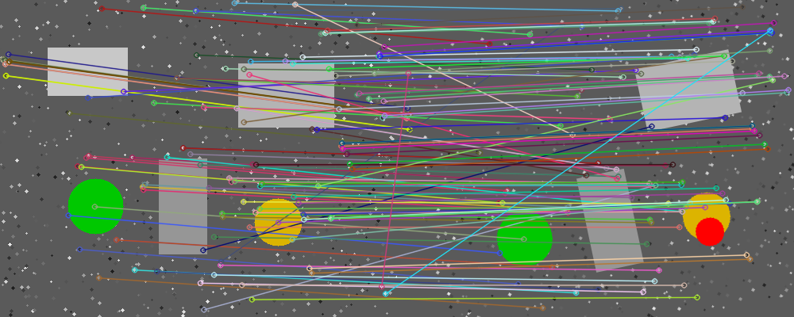
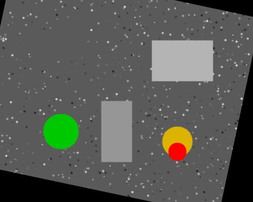
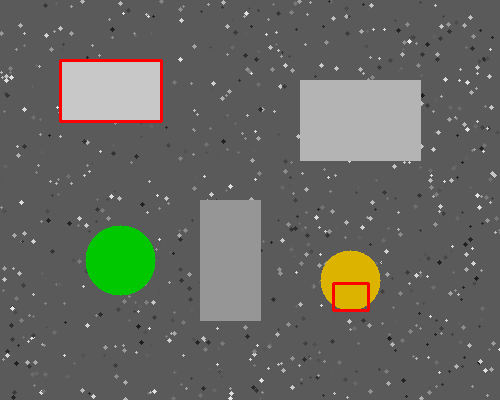

# Vision Part Inspection — SIFT alignment & defect detection

A classical computer-vision pipeline (OpenCV) that locates a part in a scene, aligns it to a reference using **SIFT + FLANN + RANSAC homography**, and highlights **defects / missing components** by comparison.

## What it does
1. Detect **SIFT** keypoints/descriptors on a reference and a scene image.
2. Match them with **FLANN** + Lowe's ratio test.
3. Estimate the **scene → reference homography** with **RANSAC**.
4. **Warp** the scene into the reference frame.
5. **Compare** the two images to flag defects (bounding boxes).

## Tech
`Python` · `OpenCV` · `NumPy` — SIFT / FLANN / RANSAC / homography / image differencing

## Run
```bash
pip install -r requirements.txt
python make_sample.py     # generates a demo reference/scene pair in images/
python align.py           # runs the pipeline, writes results to outputs/
```
Use your own images:
```bash
python align.py --ref path/to/reference.png --scene path/to/scene.png
```

## Results
| Feature matches | Aligned scene | Detected defects |
|:---:|:---:|:---:|
|  |  |  |

## How it works (short)
Feature-based registration makes the inspection robust to rotation, translation and scale: the part is found and re-aligned before comparison, so the defect detection is not fooled by the object simply being moved or rotated.

## Data & confidentiality
The images in this repository are **synthetic** (generated by `make_sample.py`) and free to use. They reproduce the *type* of inspection problem I solved in a production setting. The real industrial images I worked on during my final-year project are **proprietary and cannot be shared**.

## About
Built by **Ahmed Mehouachi** — Software Engineer, Applied AI & Computer Vision.
🔗 [linkedin.com/in/mehouachiahmed](https://www.linkedin.com/in/mehouachiahmed)
